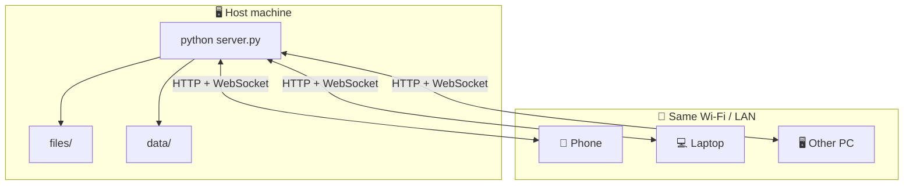

<div align="center">


# LanBox

### Share files, chat, and notes on your local network — no cloud required.

[](https://www.python.org/)
[](https://flask.palletsprojects.com/)
[](https://socket.io/)
[](LICENSE)
[](https://github.com/alixahedi/LanBox)

**One machine hosts · Every device on Wi‑Fi connects in the browser**

[Quick start](#-quick-start) · [Features](#-features) · [How it works](#-how-it-works) · [API](#-api-reference) · [Contributing](CONTRIBUTING.md)

</div>

---

## ✨ Why LanBox?

| | |
|:---:|:---|
| 🏠 | **Stays on your LAN** — data never leaves your network |
| 📱 | **Browser-only clients** — phones, tablets, and PCs, no install |
| ⚡ | **Live updates** — files, chat, and online users via WebSocket |
| 🔒 | **Optional encryption** — password-locked files & private encrypted chat |
| 🌓 | **Dark & light themes** — comfortable day or night |

> Run `python server.py` on one PC, open `http://192.168.x.x:3000` on the rest.

---

## 🖼️ Features

<table>
<tr>
<td width="50%" valign="top">

### 📂 File sharing
Drag & drop uploads, downloads, and deletes.  
Optional **password-protected** files encrypted in the browser before upload.

### 💬 Chat
- **Broadcast** — message everyone on the LAN  
- **Private DM** — encrypted one-to-one chat  
- **Unread badges** on the online list — tap a user to open their chat

</td>
<td width="50%" valign="top">

### 📌 Notes wall
Shared sticky notes for quick LAN-wide reminders.

### 👥 Online users
Live presence sidebar — see who is connected right now.

### 🔔 In-app alerts
No browser permission popups. Toasts & badges stay inside the app.

</td>
</tr>
</table>

---

## 🔁 How it works



1. **Host** starts the server and shares the address shown in the UI banner.  
2. **Clients** pick a username once (saved per device).  
3. **Everyone** uploads files, chats, and posts notes in real time.

---

## 🚀 Quick start

### Prerequisites

- Python **3.8+**
- Devices on the **same local network**

### Install & run

```bash
git clone https://github.com/alixahedi/LanBox.git
cd LanBox
pip install -r requirements.txt
python server.py
```

**Windows:** double-click `lanbox.bat` — installs dependencies and starts the server (auto-restart on crash).

### Connect

```
http://192.168.1.10:3000
```

Replace with your host machine's LAN IP (shown in the terminal and in-app banner).

| Step | Action |
|:----:|--------|
| 1️⃣ | Open the URL in **Chrome**, **Edge**, or **Safari** |
| 2️⃣ | Choose a **username** (stored on that device) |
| 3️⃣ | Share files, broadcast chat, or DM someone from **Online** |

---

## 🔔 Notifications (in-app)

LanBox keeps alerts **inside the app** — no OS notification permission needed.

| Event | What you see |
|-------|----------------|
| 📩 Private message (chat not open) | Badge on sender in **Online** — e.g. `3 messages` |
| 👆 Click user in **Online** | Opens private chat · clears badge |
| 📢 Broadcast (other chat open) | Toast at bottom |
| 📁 New file from someone else | Toast at bottom |

---

## ⚙️ Server options

```bash
python server.py                  # HTTP on port 3000 (default)
python server.py --port 8080      # Custom port
python server.py --no-mdns        # Disable mDNS discovery
python server.py --host 0.0.0.0   # Listen on all interfaces (default)
```

| Variable | Description |
|----------|-------------|
| `LANBOX_PORT` | Port number |
| `LANBOX_SECRET` | Flask session secret (optional) |

### Windows helpers

| Script | Purpose |
|--------|---------|
| `lanbox.bat` | Install deps · run server · auto-restart |
| `install-startup.bat` | Add to Windows startup |
| `remove-startup.bat` | Remove from startup |
| `lanbox-background.bat` | Run in background |

---

## 📁 Project structure

```
LanBox/
├── 🐍 server.py              Flask + Socket.IO backend
├── 📂 paths.py               Runtime paths
├── 🌐 web/
│   ├── app.js                UI · chat · uploads
│   ├── crypto.js             Encryption helpers
│   ├── index.html
│   ├── style.css
│   └── icons/              App logo (192 & 512)
├── 📦 files/                 Uploaded files (runtime)
├── 🗄️ data/                  Users · messages · notes (runtime)
└── 🪟 lanbox.bat             Windows launcher
```

---

## 📡 API reference

<details>
<summary><b>REST endpoints</b> — click to expand</summary>

<br>

| Method | Endpoint | Description |
|--------|----------|-------------|
| `GET` | `/api/server/info` | Server IP, port, URL |
| `POST` | `/api/users/register` | Register username + public key |
| `GET` | `/api/users/online` | Online users |
| `GET` | `/api/chat/broadcast/history` | Broadcast history |
| `POST` | `/api/chat/broadcast/send` | Send broadcast |
| `GET` | `/api/chat/history` | Private message history |
| `POST` | `/api/chat/send` | Send encrypted private message |
| `POST` | `/api/chat/delete-mine` | Delete all messages for a user |
| `POST` | `/api/upload` | Upload file |
| `GET` | `/api/files` | List files |
| `GET` | `/api/notes` | List notes |

**Socket.IO events:** `broadcast_message` · `chat_message` · `file_uploaded` · `online_users` · `chats_deleted`

</details>

---

## 🛡️ Security

> **Built for trusted local networks** — home Wi‑Fi, lab, office.

- Usernames only — no accounts or passwords for joining  
- Usernames stored per device in `localStorage`  
- Chat & files use browser crypto (with HTTP LAN fallback)  
- Anyone with the server URL on your LAN can connect  

**Do not** expose LanBox directly to the public internet without extra hardening.

---

## 🤝 Contributing

Contributions are welcome! See **[CONTRIBUTING.md](CONTRIBUTING.md)** for setup and PR guidelines.

---

## 📄 License

This project is licensed under the **MIT License** — see [LICENSE](LICENSE).

---

<div align="center">

**LanBox** — your LAN, your data.

Made with care by [**Ali Zahedi**](https://github.com/alixahedi)

⭐ Star the repo if you find it useful

</div>
